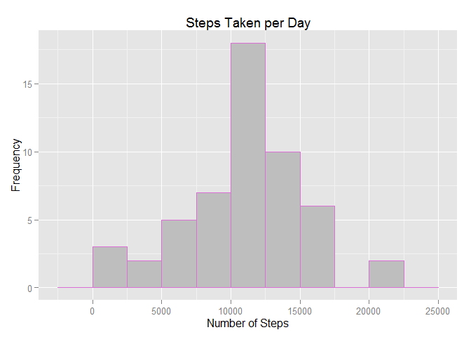
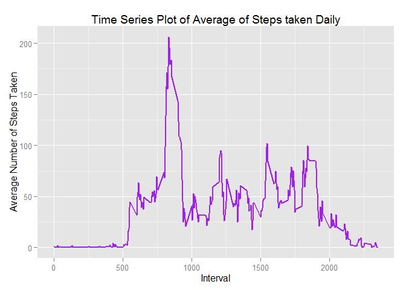
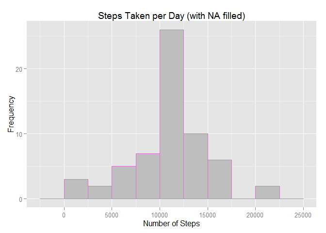
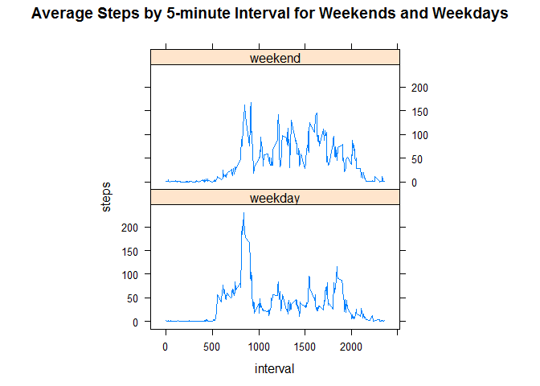

# Reproducible Research: Peer Assessment 1
msuppo  
18/07/2015  

# Synopsis
The purpose of this project was practicing:

- loading and preprocessing data
- imputing missing values
- interpreting data to answer research questions

# Data
The data for this assignment was downloaded from the course web site:

Dataset: [Activity monitoring data](https://d396qusza40orc.cloudfront.net/repdata%2Fdata%2Factivity.zip)

The variables included in this dataset are:

- steps: Number of steps taking in a 5-minute interval (missing values are coded as NA)

- date: The date on which the measurement was taken in YYYY-MM-DD format

- interval: Identifier for the 5-minute interval in which measurement was taken

The dataset is stored in a comma-separated-value (CSV) file and there are a total of 17,568 observations in this dataset.

## Loading and preprocessing the data

**- Problem statement 1:** Load the data

- Libraries required: for plotting (ggplot2 and lattice) and transforming data (plyr)
- Set the Working environment
- Data file is downloaded if it's not present
- The file is uncompressed 
- The file is read as a data frame

**- Problem statement 2:** Process/transform the data into a format suitable for your analysis, transform colum class

- The "steps" column is considered to Numeric type.
- The "date" column is considered to Date type and it is converted to Date format
- The "interval" column is considered to Numeric type
- Examine the data

The code for Problem statement 1 and 2 is the folowing:


```r
library(ggplot2)
library(lattice)
library(plyr)
setwd("C:/Users/usuariodell/Desktop/DS/6 REPRODUCIBLE RESEARCH")

read_data <- function() {
  file_name = "activity.zip"
  source_url = "https://d396qusza40orc.cloudfront.net/repdata%2Fdata%2Factivity.zip"
  if (!file.exists(file_name)) {
    download.file(source_url, destfile = file_name)
  }
  tempdata <- unz(file_name, "activity.csv")
  tabla <- read.csv(tempdata, header = T, colClasses = c("numeric", "character", 
                                                  "numeric"))
  tabla$date <- as.Date(tabla$date, format = "%Y-%m-%d")
  tabla
}
tabla <- read_data()
```

Examine the data


```r
summary(tabla)
```

```
##      steps             date               interval     
##  Min.   :  0.00   Min.   :2012-10-01   Min.   :   0.0  
##  1st Qu.:  0.00   1st Qu.:2012-10-16   1st Qu.: 588.8  
##  Median :  0.00   Median :2012-10-31   Median :1177.5  
##  Mean   : 37.38   Mean   :2012-10-31   Mean   :1177.5  
##  3rd Qu.: 12.00   3rd Qu.:2012-11-15   3rd Qu.:1766.2  
##  Max.   :806.00   Max.   :2012-11-30   Max.   :2355.0  
##  NA's   :2304
```


## What is mean total number of steps taken per day?

The missing values in the dataset are ignored tor this part of the assignment

**- Problem statement 1:** Calculate the total number of steps taken per day


```r
tablabyDay <- aggregate(steps ~ date, tabla, sum, na.action = na.pass)
```


**- Problem statement 2:** If you do not understand the difference between a histogram and a barplot, research the difference between them. Make a histogram of the total number of steps taken each day

Histogram of the total number of steps taken by Day and plotted with a bin interval of 2500 steps.


```r
ggplot(tablabyDay, aes(x = steps)) + geom_histogram(binwidth = 2500, colour = "orchid", 
    fill = "grey") + labs(title = "Steps Taken per Day", x = "Number of Steps", 
    y = "Frequency")
```

 

**- Problem statement 3:** Calculate and report the mean and median of the total number of steps taken per day


```r
daily_steps_mean   <- mean(tablabyDay$steps, na.rm=TRUE)
daily_steps_median <- median(tablabyDay$steps, na.rm=TRUE)
```
The **Mean** is: 1.0766189\times 10^{4}  
The **Median** is: 1.0765\times 10^{4}     


## What is the average daily activity pattern?


**- Problem statement 1:** Make a time series plot (i.e. type = "l") of the 5-minute interval (x-axis) and the average number of steps taken, averaged across all days (y-axis)


```r
tablabyInterval <- aggregate(steps ~ interval, data = tabla, mean, na.rm = TRUE)
ggplot(data=tablabyInterval,aes(x=interval,y=steps))+ geom_line(color = "purple", size = 1)+
labs(title="Time Series Plot of Average of Steps taken Daily", x="Interval", y="Average Number of Steps Taken") 
```

 
    

**- Problem statement 2:** Which 5-minute interval, on average across all the days in the dataset, contains the maximum number of steps?


```r
interval_max <-tablabyInterval[which.max(tablabyInterval$steps), ]$interval
```

The 5-minute interval that contains the maximum number of steps is the **835th**


## Imputing missing values


Note that there are a number of days/intervals where there are missing values (coded as NA). The presence of missing days may introduce bias into some calculations or summaries of the data.

**- Problem statement 1:** Calculate and report the total number of missing values in the dataset (i.e. the total number of rows with NAs)


```r
missing_valores <- sum(is.na(tabla$steps))
```

The total number of **missing values** are **2304**  

**- Problem statement 2:** Devise a strategy for filling in all of the missing values in the dataset. The strategy does not need to be sophisticated. For example, you could use the mean/median for that day, or the mean for that 5-minute interval, etc.

The strategy for filing in all of the missing values was using the mean for that 5-minute interval. So, the function "meanIntSteps" was defined to get the mean steps for particular 5-minute interval.  


```r
meanIntSteps <- function(interval) {
    tablabyInterval[tablabyInterval$interval == interval, ]$steps
}
```
  
**- Problem statement 3:** Create a new dataset that is equal to the original dataset but with the missing data filled in.


```r
tabla2 <- tabla  
count = 0  
for (i in 1:nrow(tabla2)) {
    if (is.na(tabla2[i, ]$steps)) {
        tabla2[i, ]$steps <-  meanIntSteps(tabla2[i, ]$interval)
        count = count + 1
    }
}
missing_valores2 <- sum(is.na(tabla2$steps))
```
The total number of **missing values** in the new dataset is **0**  

**- Problem statement 4:** Make a histogram of the total number of steps taken each day and Calculate and report the mean and median total number of steps taken per day. Do these values differ from the estimates from the first part of the assignment? What is the impact of imputing missing data on the estimates of the total daily number of steps?


```r
tablabyDay2 <- aggregate(steps ~ date, data = tabla2, sum)
ggplot(tablabyDay2, aes(x = steps)) + geom_histogram(binwidth = 2500, colour = "orchid", 
    fill = "grey") + labs(title = "Steps Taken per Day (with NA filled)", x = "Number of Steps", 
    y = "Frequency")
```

 

```r
daily_steps_mean2   <- mean(tablabyDay2$steps)
daily_steps_median2 <- median(tablabyDay2$steps)
```

The **previous Mean** is: 1.0766189\times 10^{4}  
The **previous Median** is: 1.0765\times 10^{4}     

The **new Mean** with NA filled:  1.0766189\times 10^{4}  
The **new Median** with NA filled: 1.0766189\times 10^{4}     


For both cases (with and without NA) the **Mean** produce the same value, but the **Median** differ slightly with this strategy.

The impact of imputing missing data on the estimates of the total daily number of steps in this case is minimun, and it depends on how the missing data are imputed. Since here, the average for a given interval was used, there was practically no difference because it basically pulled the averages closer to the inserted average value.


## Are there differences in activity patterns between weekdays and weekends?

For this part the weekdays() function may be of some help here. Use the dataset with the filled-in missing values for this part.

**- Problem statement 1:** Create a new factor variable in the dataset with two levels -- "weekday" and "weekend" indicating whether a given date is a weekday or weekend day.


```r
tabla2$day = ifelse(as.POSIXlt(as.Date(tabla2$date))$wday%%6 == 
    0, "weekend", "weekday")
tabla2$day = factor(tabla2$day, levels = c("weekday", "weekend"))
```

**- Problem statement 2:** Make a panel plot containing a time series plot (i.e. type = "l") of the 5-minute interval (x-axis) and the average number of steps taken, averaged across all weekday days or weekend days (y-axis). 


```r
tablabyInterval2 <- aggregate(steps ~ interval + day, tabla2, mean)
xyplot(steps ~ interval | factor(day), data = tablabyInterval2, aspect = 1/2, 
    type = "l", main = "Average Steps by 5-minute Interval for Weekends and Weekdays")
```

 
